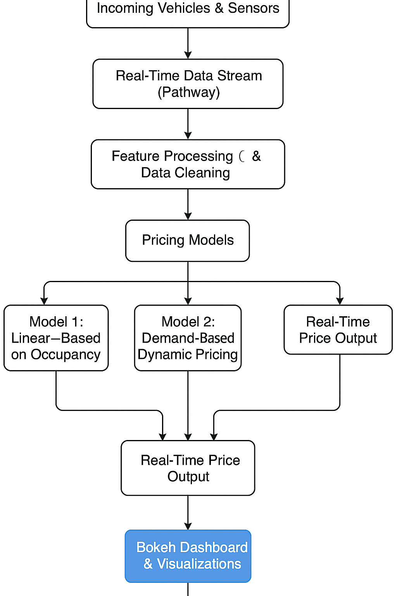

# Dynamic-pricing-models-for-parking-lots-

## A Breif Overview of the Project 

Dynamic Pricing Models for Parking Lots with Real-Time Simulation
This project simulates dynamic pricing for urban parking spaces for 14 urban parking lots to improve their utilization. 
using real time real time data streams ,Pathway(for streaming),and Bokeh(for visualization).
Our main goal is to build a pricing engine that adjusts parking fees in real-time based on a variety of factors.

Objective: Develop a pricing model that updates a base price of $10 in real-time. The price changes should be smooth and explainable,
Methodology: You are required to build three models from scratch using only Python, Pandas, and Numpy

The Models:
Baseline Linear Model: A simple starting point where the price increases linearly with the parking lot's occupancy.
Demand-Based Model: A more advanced model where you create a demand function based on occupancy, queue length, traffic, and other features to set the price.
Competitive Pricing Model (Optional): An advanced model that incorporates the prices of nearby competitor parking lots, determined by their geographic location.
These models caluculates prices based on demand , occupancy, traffic, and nearby competitors 

## 🧰 Tech Stack
- **Python** – Core programming language
- **Pandas, NumPy** – Data preprocessing and for Exploratory data analysis
- **Pathway** – Real-time streaming and processing engine
- **Bokeh** – Real-time visualization of pricing
- **Google Colab** – Development IDE environment
- **Mermaid** – Architecture diagrams

## 🗺 Architecture Diagram

 

### 🧠 Project Architecture & Workflow

1.  ***Data Source***
    A historical CSV file containing past parking data is used to create a realistic, simulated live data stream.This file includes key information for each parking lot, such as its current occupancy, nearby traffic levels, the number of cars in the queue, and indicators for special days like holidays or events.

2.  ***Streaming with Pathway***
    Pathway's `pw.io.csv.read` function ingests the data row-by-row from the CSV file in streaming mode This process simulates a real-time environment where data arrives sequentially.Pathway intelligently manages the data by its timestamp, ensuring that the information is processed in the correct chronological order as if it were coming from a live sensor network
    - Data is streamed row-by-row to simulate real-time updates  
   - Uses pw.io.csv.read() in streaming mode with timestamp parsing  

4.  ***Feature Processing***
    As the raw data streams in, it is processed in real-time to create more meaningful features for the pricing models.This involves cleaning the data and performing transformations, such as calculating the occupancy rate (occupancy divided by capacity) or converting categorical traffic levels (like "Low" or "High") into numerical weights.
    Data cleaning and feature transformation (occupancy ratio, traffic weights, etc.)
   - Features are transformed in Real Time
   - such as  Occupancy by time , Occupancy over a hour of the day , queue lemgth over the time , traffic condition ,
   occupancy vs traffic condtions , occupancy by vehicle type and its traffic conditions

6.  ***Pricing Models Implemented***
    Three distinct pricing models are built to run on the streaming data
    * **Model 1 (Linear)**: A baseline model where the price increases in a straight line as occupancy goes up
    * **Model 2 (Demand-Based)**: A more sophisticated model that calculates a "demand" score from multiple features (occupancy, queue length, traffic, etc.) to set a more nuanced price
    * **Model 3 (Competitive)**: The most advanced model, which, in addition to demand factors, also considers the prices of nearby competing parking lots to make strategic price adjustments

7.  ***Price Output***
    For every new piece of data that comes through the stream, the pricing models instantly recalculate the price for each parking lot. These newly computed prices are then broadcasted as a continuous output stream, ready to be used by other systems, such as a live dashboard or a user-facing application.
    - Prices are calculated in real-time and output continuously  
   - Final prices are streamed to a live dashboard
   -  Final price is Computed using @pw.udf logic inside the pathway stream 

9.  ***Bokeh Visualizations***
    A live dashboard built with Bokeh visualizes the price outputs in real-time. It uses a feature called `ColumnDataSource.stream()` to efficiently update the graphs without redrawing them entirely.This allows you to watch **line plots of the prices** as they evolve and change in response to the incoming data, providing a clear and immediate justification for the models' behavior.

   **Relavant Documentation**
   

  

